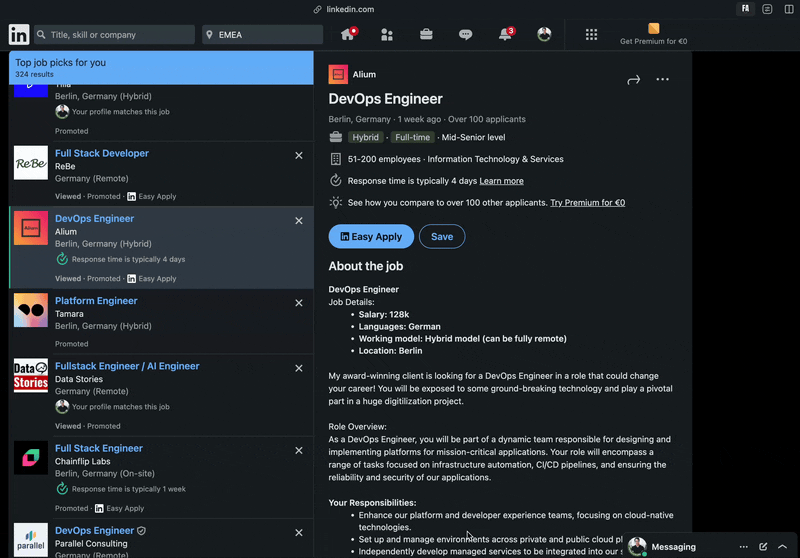

# Fapplier

> a chrome extension tools which parses the current web page and generates a cover letter for you.

> 🚧 This project is still under development.



## Installing

1. Check if your `Node.js` version is >= **18** and [pnpm](https://pnpm.io/) is installed.
2. Change or configurate the name of your extension on `src/manifest`.
3. Run `pnpm install` to install the dependencies.
4. Setup [Google Cloud CLI](https://cloud.google.com/cli?hl=en) and activate [Google Cloud Vertex AI](https://cloud.google.com/vertex-ai/generative-ai/docs/reference/nodejs/latest)

## Developing

run the command

```shell
cd fapplier

pnpm run dev
```

### Chrome Extension


1. set your Chrome browser 'Developer mode' up
2. click 'Load unpacked', and select `fapplier/build` folder

### Backend

The backend is based on Google Functions (which is in the end a simple ExpressJS). The function you can find inside the `src/functions`. These functions run in the background by using [Ghosttp](https://github.com/jolo-dev/ghosttp).

1. The backend will be accessed via `http://localhost:3000/`
2. The terminal shows what endpoints exists e.g. `http://localhost:3000/create-coverletter`

## Packing

After the development of your extension run the command

```shell
pnpm run build
```

Now, the content of `build` folder will be the extension ready to be submitted to the Chrome Web Store. Just take a look at the [official guide](https://developer.chrome.com/webstore/publish) to more infos about publishing.

---

Generated by [create-chrome-ext](https://github.com/guocaoyi/create-chrome-ext)
